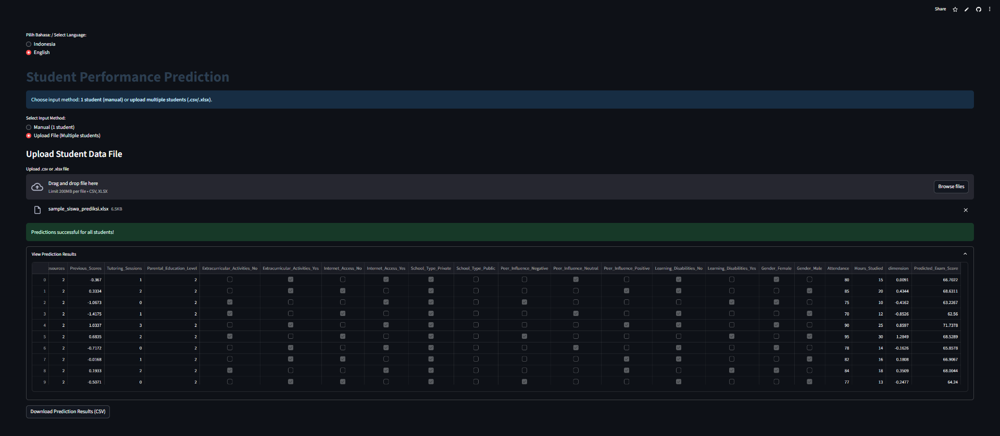

# Student Exam Score Prediction Web Application using Python and Streamlit

## Project Information 
An interactive web application built using Python and Streamlit predicts student exam scores based on factors correlated with exam scores, such as hours studied, attendance, parental involvement, access to resources, previous scores, tutoring sessions, and parental education level. Furthermore, the application considers nominal categorical factors such as learning disabilities, gender, extracurricular activities, internet access, school type, and peer influence. A regression model based on the Random Forest algorithm is used to generate accurate predictions, with an MSE value of 3.159578 on the test data, thus supporting targeted interventions and improving student learning outcomes. The application uses the Student Performance dataset from [Kaggle](https://www.kaggle.com/datasets/lainguyn123/student-performance-factors). 

[Click here to open the Streamlit app](https://predicted-exam-scores.streamlit.app/)

Note: This model is intended for research and demonstration purposes only. Due to differences in assessment standards, curricula, school quality, and cultural contexts, these predictions cannot be directly applied to student evaluations outside the context of the dataset.

## Project Overview
Student test scores are influenced by internal and external factors. This app helps teachers and educators identify early on the likelihood that students will score below the required standard. By using internal and external factors correlated with test scores with a trained machine learning regression model, the app provides accurate score predictions to support targeted interventions and improve learning outcomes.

## Application Preview
This application provides two data input methods:

1. Input manual (singel student) - fill an interactive form.

Users can enter data for one student manually via an interactive

2. Upload file (multiple students) - submit a CSV/XLSX with many students and get batch predictions

Users can upload .csv or .xlsx files containing data from multiple students for mass prediction. The prediction results can be downloaded in CSV format.

Upload File (Multiple Students) preparing your CSV/XLSX
- Supported formats: .csv or .xlsx. For .xlsx the environment must have openpyxl installed.
- Important: The app expects specific column names. Provide exactly these columns (names are case-sensitive and must include underscores wher shown):

```bash
Example CSV
Parental_Involvement,Access_to_Resources,Previous_Scores,Tutoring_Sessions,Parental_Education_Level,Extracurricular_Activities_No,Extracurricular_Activities_Yes,Internet_Access_No,Internet_Access_Yes,School_Type_Private,School_Type_Public,Peer_Influence_Negative,Peer_Influence_Neutral,Peer_Influence_Positive,Learning_Disabilities_No,Learning_Disabilities_Yes,Gender_Female,Gender_Male,Attendance,Hours_Studied
2,2,70,1,College,False,True,False,True,True,False,False,True,False,True,False,True,False,80,15
2,2,80,2,College,False,True,True,False,True,False,False,False,True,True,False,False,True,85,20
```


Example XLSX
| Parental_Involvement | Access_to_Resources | Previous_Scores | Tutoring_Sessions | Parental_Education_Level | Extracurricular_Activities_No | Extracurricular_Activities_Yes | Internet_Access_No | Internet_Access_Yes | School_Type_Private | School_Type_Public | Peer_Influence_Negative | Peer_Influence_Neutral | Peer_Influence_Positive | Learning_Disabilities_No | Learning_Disabilities_Yes | Gender_Female | Gender_Male | Attendance | Hours_Studied |
|----------------------|---------------------|-----------------|-------------------|--------------------------|--------------------------------|--------------------------------|--------------------|---------------------|--------------------|-------------------|-------------------------|-------------------------|--------------------------|--------------------------|---------------------------|---------------|-------------|------------|---------------|
| 2                    | 2                   | 70              | 1                 | College                  | FALSE                          | TRUE                           | FALSE              | TRUE                | TRUE               | FALSE             | FALSE                   | TRUE                    | FALSE                    | TRUE                     | FALSE                     | TRUE          | FALSE       | 80         | 15            |
| 2                    | 2                   | 80              | 2                 | College                  | FALSE                          | TRUE                           | TRUE               | FALSE               | TRUE               | FALSE             | FALSE                   | FALSE                   | TRUE                     | TRUE                     | FALSE                     | FALSE         | TRUE        | 85         | 20            |


## EDA Matplotlib and Seaborn


The plot titled "Exam Score" shows the distribution of exam scores with the majority of students scoring in the 64-70 range.


The plot titled "Correlation Matrix for Numerical Features" displays the correlation between variables to the exam score showing that Hours_Studied and Attendance have a fairly strong relationship with Exam_Score.

## Technologies Used
- Python
- Streamlit
- Pandas
- Numpy
- Matplotlib
- Seaborn
- Scikit-learn
- Joblib

## Installation & Setup

```bash
1. Clone the repository
git clone https://github.com/AgiF27/predicted-exam-scores.git
cd predicted-exam-scores

2. Create and activate a virtual environment
python -m venv venv
venv\Scripts\activate # Windows
source venv/bin/activate # macOS/Linux

3. Install dependencies
pip install -r requirements.txt

4. Run the application locally
streamlit run app.py